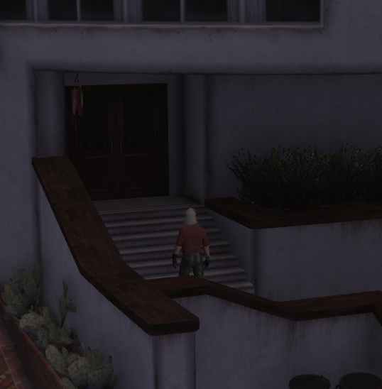
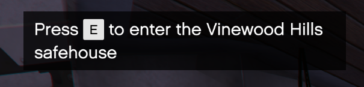
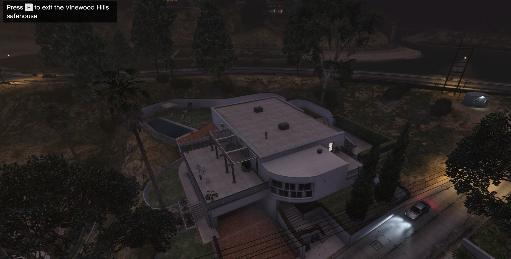

# enter #

Sometimes all a location does is to provide a menu. You still want the illusion or *feeling* of being in the house, but having an actual interior is a massive overkill for your needs.

That's where this resource comes in.

# Work in progress

This resource is absolutely still a work in progress, and the documentation doubly so.

# Synopsis

```lua
TriggerEvent('enter:add-locations',{
    {
        label = "the Vinewood Hills safehouse",
        door = vec4(-189.317,617.818,199.666,182.796),
        cam = vec3(-204.328,592.915,226.795),
        inside = vec3(-182.731,631.632,199.315),
    },
})
```

This will make it so that you can walk up to a door, wait for a bit for the prompt to appear, press E, and then you're in the house.  Being in there is illustrated with a nice "establishing shot"-style view.

Walk up to this door:



Wait for this prompt to appear:



Press E to get this view:



## Okay, what good is that?

It does nothing, except maybe hide you. Your player ped will be transported inside the building when you do this. The whole `inside =` part sets *where*.

There are an absolutely absurd number of settings.

# Settings

| Setting     | Purpose                                                       |
|-------------|---------------------------------------------------------------|
| blur        | Blur the cam view when inside a location                      |
| cam         | The location of the camera when inside                        |
| dof         | The Depth of Field planes of the camera                       |
| door        | The location of the door to enter/exit                        |
| enterEvent  | Event that fires when you enter the location                  |
| exitEvent   | Event that fires when you exit the location                   |
| inside      | The inside location where your player ped will be stored      |
| label       | The label to put on the enter/exit prompt                     |
| multicam    | A list of additional cameras to switch between                |
| nightvision | Does the camera have nightvision?                             |
| range       | The distance from `door` considered "close enough"            |
| state       | A state check to perform before presenting the door           |
| wait        | The time you need to wait inside `range` before you can enter |

*Note:* Of these, only `door` is **required**.

## blur

## cam

## dof

## door

## enterEvent

## exitEvent

## inside

## label

## multicam

## nightvision

## range

## state

## wait